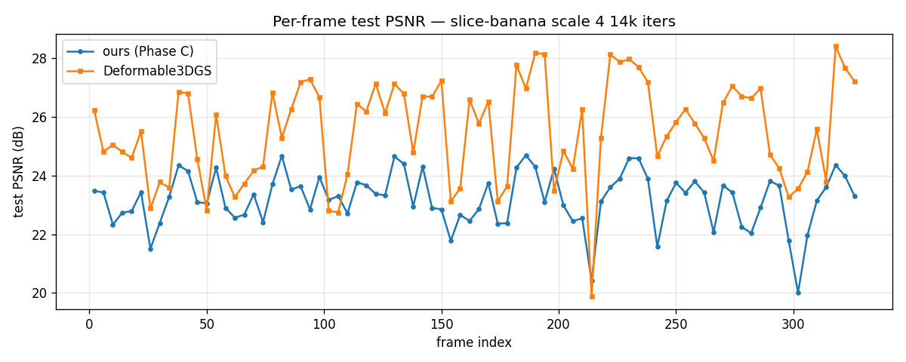

# RCA — Phase C vs Deformable3DGS on slice-banana scale 4 14k iters

Aggregate over 82 test frames (deformable_interp val split, ids[2::4]):

| metric | ours (Phase C) | Deformable3DGS | gap |
|---|---|---|---|
| PSNR (dB) | 23.19 | 25.52 | -2.33 |
| L1 | 0.0437 | 0.0322 | +0.0115 |

## Worst-3 frames of ours (per-frame heatmaps)

- frame 302: ours 20.00dB, d3dgs 23.55dB, Δ -3.55
  
- frame 214: ours 20.42dB, d3dgs 19.87dB, Δ +0.55
  
- frame  26: ours 21.51dB, d3dgs 22.88dB, Δ -1.37
  