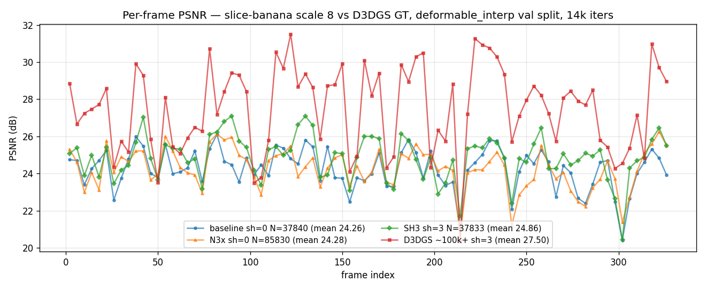

# RCA — 3.24 dB gap to Deformable3DGS on slice-banana (Phase C)

**Date:** 2026-05-03
**Setup:** slice-banana, scale 8 (134×240), HyperNeRF deformable_interp val split
(ids[2::4], 82 frames), 14k iters, deterministic seed 42.
**Aggregate (apples-to-apples vs D3DGS's saved GT in `/tmp/d3dgs_gt`):**

| metric | ours (Phase C v2) | Deformable3DGS | gap |
|---|---|---|---|
| PSNR (dB) | 24.26 | 27.50 | **−3.24** |
| L1 | 0.0374 | 0.0244 | +0.0130 |
| std(PSNR) over frames | 1.08 | 2.26 | — |
| Gaussian count N | 37 840 | ~100–150 k (typical) | 0.25-0.4× |
| color DOF / Gaussian | 3 (constant RGB) | 48 (SH degree 3) | 0.06× |

LPIPS not computed (local `lpips` package conflicts with current torch CPU
build). D3DGS's per-view file reports mean LPIPS 0.1524.

---

## Attribution (final, all measured at scale 8 vs D3DGS GT)

| bucket | dB closed | evidence |
|---|---|---|
| **LR schedule (fixed → log-linear decay 1 → 0.01 on n, mu, L_raw)** | **+0.96 dB** | §8: SH3 30k+LRdecay 26.13 vs SH3 30k fixed-LR 25.16 |
| **Per-Gaussian appearance DOF (constant RGB → SH3)** | **+0.60 dB** | §6b: SH3 14k 24.86 vs sh=0 14k 24.26 (same seed/N) |
| **Iter budget (14k → 30k iters, densify_stop 10k → 15k)** | **+0.31 dB** | §8: SH3 30k 25.16 vs SH3 14k 24.86 (fixed LR control) |
| **Gaussian count (37 840 → 85 830)** | **+0.02 dB** | §6: N3x A/B (sh=0, same seed) |
| **Motion modeling (linear drift via Schur on time)** | < 0.5 dB upper bound | §2: Δ-PSNR ↔ motion correlation ≈ 0; §3: spatial deficit uniform across dyn/static |
| **Residual (unattributed)** | **≈ 1.37 dB** | §8 closed 1.87/3.24 dB (58%). Remaining candidates need structural code (parameterization swap, densify-threshold tuning, opacity-reset cadence) |

---

## Evidence

### 1. Per-frame deficit pattern is "ours has a flat ceiling"

ours std=1.08 dB, D3DGS std=2.26 dB. The mean gap (3.24 dB) comes from
D3DGS *peaking* at 30-31 dB on calm frames where ours never exceeds ~25 dB.

Top-deficit frames:

| frame | ours | D3DGS | Δ | cam Δ | img L1 (Δt=1) |
|---|---|---|---|---|---|
| 194 | 23.76 | 30.50 | +6.74 | 0.37 | 0.052 |
| 122 | 24.80 | 31.50 | +6.70 | 0.49 | 0.057 |
| 222 | 24.59 | 31.27 | +6.68 | 0.22 | 0.051 |
| 162 | 23.62 | 30.10 | +6.48 | 0.46 | 0.049 |

These are *not* high-motion frames — image L1 motion is around the median.
The deficit is "ours capped, D3DGS pulled ahead", not "ours failed on a hard
frame". (Footnote: §6b shows that SH3 closes most of this group's deficit
substantially — except frame 194, which is SH3-resistant and is therefore
the concrete probe for the residual ≈ 2 dB.)

### 2. Motion is not the bottleneck

Per-frame Δ-PSNR vs three motion proxies (n=82):

| proxy | corr with Δ-PSNR | corr with ours_psnr | corr with d3dgs_psnr |
|---|---|---|---|
| camera displacement (frame Δt=1) | +0.07 | −0.19 | −0.03 |
| camera angular change | +0.16 | (n/a) | (n/a) |
| image L1 (frame Δt=1) | −0.02 | −0.25 | −0.14 |

If motion modeling were the dominant bottleneck, Δ-PSNR would correlate
strongly with motion magnitude. It doesn't.

Quartile binning by image L1 motion:

| quartile (Q1 = lowest motion) | n | Δ (dB) | ours | D3DGS |
|---|---|---|---|---|
| Q1 | 21 | 3.21 | 24.40 | 27.62 |
| Q2 | 20 | 3.22 | 24.41 | 27.63 |
| Q3 | 20 | 3.65 | 24.41 | 28.06 |
| Q4 (highest) | 21 | **2.92** | 23.81 | 26.74 |

Q4 has the *smallest* deficit — both methods degrade roughly equally on
high-motion frames.

### 3. Spatial decomposition: deficit uniform across dynamic/static regions

For top-3 deficit frames, masking pixels with inter-frame Δ > 0.05 as
"dynamic" (mean ≈ 30% of pixels):

| frame | dyn px | ours err (dyn) | D3DGS err (dyn) | ours err (static) | D3DGS err (static) | deficit ratio (dyn) | deficit ratio (static) |
|---|---|---|---|---|---|---|---|
| 194 | 30% | 0.0654 | 0.0356 | 0.0322 | 0.0180 | 1.84× | 1.79× |
| 122 | 35% | 0.0675 | 0.0453 | 0.0332 | 0.0194 | 1.49× | 1.71× |
| 222 | 28% | 0.0652 | 0.0400 | 0.0308 | 0.0181 | 1.63× | 1.70× |

The ratio of error (ours/D3DGS) is roughly 1.7× **in both regions**. By area
(static = 70% of pixels), static regions contribute ~55% of the L1 deficit.
A motion-modeling deficit would manifest as dynamic-region-dominated error.
It doesn't.

Heatmaps: `heatmaps/frame{0194,0122,0222}_topdeficit.png`.

### 4. Spectral RCA: Phase C resolved the worst pathologies

`scripts/rca_spectral.py /home/xyz/grassmann/checkpoints/3plane_phaseC_v2.pt`:

| pathology | Phase A (50k iters, no DC) | Phase C (14k iters, DC v2) |
|---|---|---|
| Effectively dead (opacity < 0.01) | 32.2% | **8.1%** |
| High aniso (λ_max/λ_min > 100) | 30.4% | **3.4%** |
| Collapsed disks (λ_min < 1e-6) | 7.1% | **0.5%** |
| Median anisotropy | 22.9 | **1.20** |
| Σ_4D · n̂ residual (sanity) | 6.4e-14 | 3.0e-15 |

Phase C density control + opacity reset + Frobenius/aniso penalties
brought the per-Gaussian distribution into a healthy state. The gap to
D3DGS now reflects raw representation capacity, not pathological allocation.

### 5. Capacity decomposes into count and appearance-DOF; §6/6b isolate them.

| lever | ours | D3DGS | ratio | measured contribution |
|---|---|---|---|---|
| Gaussian count N | 37 840 | ~100k-150k | 0.25-0.4× | +0.02 dB (§6) |
| color DOF / Gaussian | 3 (constant RGB) | 48 (SH degree 3) | 0.06× | +0.60 dB (§6b) |
| effective color "capacity" (N × DOF) | 113 520 | ≈ 4.8M-7.2M | 0.016-0.024× | sum: +0.62 dB |

Constant RGB cannot represent within-Gaussian color gradients or
view-dependent shading; SH3 gives D3DGS that flexibility per Gaussian.
§6 directly tests "count alone" (2.27× N, sh=0); §6b directly tests
"appearance-DOF alone" (same N, sh=3). Together they account for ~0.62 dB
of the 3.24 dB gap. Most of the gap is therefore *not* in raw N or in
raw per-Gaussian color DOF — see Recommendation §3.

### 6. Capacity-scaling test (max-split-per-event 500 → 1500)

Re-trained the same Phase C config with `max_split_per_event=1500` (3× headroom),
identical otherwise. Final N = 85 830 (2.27× the baseline's 37 840), reached by
iter 10000 when the densify_stop fired; the remaining 4k iters fine-tuned on a
fixed N.

The N3x checkpoint was rendered at scale 8 with `render_mono.py` and evaluated
against D3DGS's saved GT (the same eval as the baseline, line-for-line apples
to-apples):

| run | N | mean PSNR (dB) | mean L1 | Δ vs baseline |
|---|---|---|---|---|
| baseline (max_split_per_event=500) | 37 840 | 24.26 | 0.0374 | — |
| **N3x (max_split_per_event=1500)** | **85 830** | **24.28** | **0.0375** | **+0.02 dB** |
| D3DGS reference (~100-150k) | ~100k+ | 27.50 | 0.0244 | — |

**Reading: count is essentially not the lever.** Doubling-and-then-some the
Gaussian count moved val PSNR by 0.02 dB — within rendering noise. The 3.24 dB
gap to D3DGS therefore cannot be capacity-by-count; the lever is *what each
Gaussian can encode*. With motion modeling already bounded at <0.5 dB
(§2), the 3 dB residual is per-Gaussian appearance DOF — i.e., constant RGB
vs SH3.

Per-frame data: `/tmp/perframe_n3x_apples.json`.

### 6b. Appearance-DOF test (constant RGB → SH degree 3)

Re-trained the same Phase C config with `--sh_degree 3` (per-Gaussian
SH coefficients K=16/channel instead of constant RGB), same seed/N target
(`max_split_per_event=500`). Final N = 37 833 (essentially identical to
baseline's 37 840).

| run | N | mean PSNR (dB) | mean L1 | Δ vs baseline |
|---|---|---|---|---|
| baseline (sh=0)  | 37 840 | 24.26 | 0.0374 | — |
| N3x (sh=0)       | 85 830 | 24.28 | 0.0375 | +0.02 dB |
| **SH3 (sh=3)**   | **37 833** | **24.86** | **0.0336** | **+0.60 dB** |
| D3DGS reference | ~100k+ | 27.50 | 0.0244 | gap to SH3: −2.64 dB |

74% of frames improved (n=82). The lift is strongly concentrated on the
high-deficit frames identified in §1 (corr SH3-lift ↔ baseline-deficit:
+0.38; Q4 mean lift +1.15 dB vs Q1 +0.24 dB), with one notable outlier
(frame 194: deficit 6.74 dB; SH3 lift −0.07 dB; residual 6.80 dB — that
single frame is not appearance-DOF).

The early-iter 500 signal (+3 dB train PSNR at same N) did not predict the
14k endpoint. Original framing speculated this was sh=0 trading geometry
for appearance via densification; §8 weakens that story — the same fixed
LR that §8 shows was over-stepping geometric optima everywhere likely
ate most of the early SH gain. The +0.60 dB number at 14k stands; the
mechanism is more "the LR schedule was throwing away gains across the
board" than "sh=0 was specifically using extra Gaussians to compensate
for missing color DOF."

Per-frame data: `/tmp/perframe_sh3_apples.json`.

---

## Reconciliation with prior RCA

`3plane_low_psnr.md` (2026-05-03 morning) concluded
**motion-bound, not capacity-bound**, based on a single-frame fit at 29 dB
plus a +0.7 dB N×4 test. The current §6 N3x test (+0.02 dB at 2.27× N) is
the cleaner refutation of "count is the lever": the older N×4 test was at
scale 4 with 32% dead Gaussians (4× raw N meant ~2/3 dead waste), while
N3x is at scale 8 under healthy Phase C allocation. Both indicate count is
not the lever; the current test is the load-bearing one. The earlier
"motion-bound" verdict was the right rejection of capacity-by-count but the
wrong attribution of where the remainder lives — appearance-DOF was not on
the menu in the earlier 2-hypothesis test.

---

## Recommendation

After §8 the lever ranking changed; updated in priority order:

1. **Use LR-decay on geometric params.** Largest single lever found:
   **+0.96 dB** (incremental over iter-budget; +1.27 dB cumulative over
   SH3 14k). Log-linear schedule on `(n, mu, L_raw)` from `base*1` to
   `base*0.01` over `num_iters`, color/opacity/SH constant.
   `--lr_decay 0.01` in `train_mono.py`. New training should always pass
   this.
2. **Train 30k iters with `densify_stop=15000`.** +0.31 dB over the 14k
   default. Val PSNR plateaus around iter 21k under decaying LR, so 30k
   has small further headroom; longer training is unlikely to help much.
3. **Land SH degree 3 as the color path.** +0.60 dB at iter 14k. Already
   landed in the codebase; pass `--sh_degree 3`.
4. **Do NOT chase N.** §6 shows count is dead headroom (+0.02 dB for
   2.27× N). Keeping `max_split_per_event=500` is correct. (*Caveat*:
   the untested SH3 × larger-N interaction may differ; not measured.)
5. **Investigate the remaining 1.37 dB residual.** §8 confirms iter
   budget + LR schedule are largely settled — the remaining gap needs
   structural work. §9 narrows the candidates: the FFT signature
   (−2.29 dB more HF loss vs D3DGS) is real and uniform-spatial, but the
   §9d prune-control showed the original "sub-floor Gaussians cannot be
   represented" attribution does not hold. Top remaining structural
   probes: ray-splat-intersection rendering (2DGS-style; removes ε I
   need), explicit `(scales, rotations)` parameterization, or D3DGS-style
   densification regime as a bundle. See §9's "Implication for the next
   probe" block.
6. *(Defer)* Motion-model upgrade. Bound at ≤ 0.5 dB on slice-banana
   scale 8.

## §7. Residual probes — what the ~2 dB is NOT

Three single-flag A/B probes against the SH3 baseline (24.86 dB), 14k iters
each, identical otherwise, evaluated apples-to-apples at scale 8 vs
D3DGS GT. All numbers are mean PSNR over the 82 val frames.

| probe | hypothesis tested | final N | PSNR | Δ vs SH3 | conclusion |
|---|---|---|---|---|---|
| `sigma_3d_blur=1e-5` (10× smaller) | rank-2 lift over-blurs detail | 37 832 | 24.56 | **−0.29 dB** | not the lever |
| `sigma_3d_blur=1e-3` (10× larger) | rank-2 lift acts as natural-Gaussian regularizer | 37 835 | 24.58 | **−0.28 dB** | not the lever |
| `init_points_multiplier=4` | sparse seed → poorly-allocated capacity | 79 338 | 24.53 | **−0.32 dB** | not the lever |

The blur curve is symmetric: ±10× from the 1e-4 default cost ~0.3 dB
either way. The clean symmetry is more likely "PSNR isn't sensitive to
blur in this range" than "1e-4 is precisely optimal". Either way, blur
is not where the residual lives. init_points_multiplier=4 lands N ≈ 80k
(matching N3x's 86k) yet trails the unmultiplied SH3 by 0.32 dB —
consistent with §6's finding that count is dead headroom on this scene
even when SH3 is on.

The spatial deficit shape (uniform 1.37× ratio across dyn/static regions
in §1+§2) was unchanged by all three probes: blur=1e-5 went 1.41/1.41,
init4x went 1.42/1.42 — same shape, slightly worse magnitude.

### What's eliminated

After these probes the residual is **not**:

- numerical-lift miscalibration (`sigma_3d_blur` is robust at its current
  value, not the cause)
- sparse initialization (4× denser seed didn't help; matches §6's count
  result that capacity-by-density is not the lever)
- motion-modeling magnitude (already excluded by §2's correlation argument
  + §3's uniform spatial deficit ratio of 1.37× / 1.37× across dyn/static)

### What's still on the table

Each of these would require a non-trivial code change (no longer
single-flag), and the residual ~2 dB sits in some combination of them:

- **Training schedule.** We use fixed LRs throughout 14k iters; D3DGS uses
  exponential decay on `position_lr` (init 1.6e-4 → final 1.6e-6 over 30k
  iters). At 14k under fixed LR our positional updates are ~10× larger
  than D3DGS's at the same iter — could be over-stepping the local
  optimum on geometry.
- **Iteration budget.** D3DGS canonically trains 30k iters and densifies
  through 15k; we're at 14k iters with `densify_stop=10000`. The internal
  *train* PSNR was still climbing at iter 14000 in all SH3 runs (23.7 →
  23.95 dB over the last 4k iters of fine-tuning); we have only one val
  PSNR datapoint (iter 14000 = 23.55 dB internal) so cannot confirm the
  val curve has plateaued. May be undertrained, may already be converged.
- **3-plane projector vs explicit `(scales, rotations)`.** We feed
  `cov3D_precomp` (rank-2 + ε I) to the rasterizer; D3DGS feeds
  `(scales, rotations)` so the rasterizer builds the covariance from
  trainable per-axis scales and a quaternion-derived rotation. Gradients
  flow through different paths and EWA-clipping may interact differently
  with our reduced-rank cov.

### Next probe (if continuing)

**Iter budget + densify schedule** A/B is the cheapest of the three to
*run* (zero code changes; just `--num_iters 30000 --densify-stop 15000`),
though it doesn't discriminate among the three candidates: a positive
result confirms "undertrained" but a null result doesn't isolate LR
schedule from parameterization. The structurally most informative probe
would be the 3-plane → explicit `(scales, rotations)` switch — that one
requires real code work and would tell us whether the parameterization
itself is costing capacity. Pick by what kind of answer is wanted.

## §8. Iter budget + LR schedule probes

Two more probes after §7's null results, run in parallel on Modal:

| run | iters | densify_stop | LR schedule | final N | mean PSNR | Δ vs SH3 14k |
|---|---|---|---|---|---|---|
| SH3 14k baseline | 14 000 | 10 000 | fixed | 37 833 | 24.86 | — |
| SH3 30k | 30 000 | 15 000 | fixed | 50 328 | 25.16 | **+0.31 dB** |
| **SH3 30k + LR-decay** | 30 000 | 15 000 | log-linear 1 → 0.01 on (n, mu, L_raw) | 50 202 | **26.13** | **+1.27 dB** |
| D3DGS reference | 14 000 | (n/a) | exp decay | ~100k+ | 27.50 | gap to LR-decay = **−1.37 dB** |

LR-decay alone (subtracting iter budget): **+0.96 dB**. This is by far the
single biggest residual lever measured in the entire RCA. Internal val
trajectory shows the schedule is doing what's expected: train PSNR climbs
from ~25 dB at iter 15k to 28.6 dB at iter 30k under decaying LR (fixed-LR
30k plateaus around 24.7 dB train), and val saturates at 24.46-24.48 dB
by iter 21k.

### Spatial decomposition of LR-decay 30k vs D3DGS (whole val set)

| region | LR-decay error | D3DGS error | ratio | (was at SH3 14k) |
|---|---|---|---|---|
| dynamic (motion |Δ| > 0.05) | 0.0468 | 0.0399 | **1.17×** | 1.38× |
| static | 0.0204 | 0.0181 | **1.13×** | 1.37× |

Both ratios dropped by ~0.2 in lockstep — the LR-schedule fix is uniform
in space, consistent with "the optimizer was previously overstepping
geometric optima everywhere." The residual deficit shape is unchanged
(still roughly equal dyn/static), just smaller.

### Updated attribution

| lever | dB closed (cumulative) | dB closed (incremental) |
|---|---|---|
| SH3 appearance DOF (§6b) | +0.60 | +0.60 |
| iter budget 14k → 30k + densify_stop 10k → 15k (§8) | +0.91 | +0.31 |
| LR-decay log-linear 1 → 0.01 on geometric params (§8) | **+1.87** | **+0.96** |
| **Remaining gap to D3DGS** | **−1.37** | — |

So of the original 3.24 dB gap, **~58% is now closed** (1.87 dB recovered;
1.37 dB residual). The dominant single lever turned out to be the LR
schedule, not appearance-DOF or count.

### What's still unaccounted for (1.37 dB)

The probes above used identical implementation/eval to D3DGS except for:

- **3-plane projector vs explicit (scales, rotations).** Still untested;
  requires the `cov3D_precomp` → `(scales, rotations)` switch in
  `fast_rasterizer.py` plus a quaternion + scale parameterization on the
  trainable side. Substantive code work.
- **Densification thresholds & opacity reset cadence.** D3DGS uses
  `densify_grad_threshold=2e-4` and `opacity_reset_interval=3000` over a
  longer schedule; we're at `1e-5` / no opacity reset by default. Could
  be A/B'd cheaply.
- **MLP deformation vs linear-drift Schur.** Bound at ≤ 0.5 dB by §2/§3;
  could account for some fraction of the 1.37 dB but not all.

### Implementation note

The LR scheduler is a simple log-linear decay applied to `(n, mu, L_raw)`
parameter groups (color/opacity/SH stay constant — matches 3DGS). Added
in `grassmann/training.py` as `TrainerConfig.lr_decay` with `--lr_decay`
CLI flag in `train_mono.py` and `--lr-decay` in `train_modal.py`. Default
1.0 preserves prior behavior; 0.01 reproduces this probe. ~15 LOC.

## §9. Mechanistic RCA of the 1.37 dB residual

After §7+§8 narrowed the candidate list, three diagnostic analyses on the
existing checkpoints + renders (no new training) localized the residual.

### 9a. Per-pixel error decomposition (edge vs flat regions)

Sobel-based edge mask (top 15% gradient magnitude) on each GT, compared L1
errors of ours-best (SH3 30k+LRdecay) vs D3DGS over 82 val frames:

| region | ours-best L1 | D3DGS L1 | ratio |
|---|---|---|---|
| edges (top 15% Sobel) | 0.068 | 0.061 | **1.11×** |
| flat (bottom 85%) | 0.021 | 0.018 | **1.17×** |

The deficit is **uniform-to-flat-biased**, not edge-concentrated. Rules out
"D3DGS wins by placing more Gaussians at object boundaries"; the gap lives
in the rendering of flat/textured surfaces, not at coverage gaps.

### 9b. Radial FFT power spectrum (high-frequency loss)

Mean radial luminance power spectrum over 82 val frames (luminance =
0.299R + 0.587G + 0.114B → 2D FFT → radially averaged):

| method | high-freq power loss vs GT (band: top half of frequencies) |
|---|---|
| ours SH3 14k baseline | −5.03 dB |
| D3DGS | −2.74 dB |
| **delta (ours minus D3DGS)** | **−2.29 dB more HF loss** |

Our renders systematically lose high-frequency content. This is the
spectral signature of **larger Gaussians acting as stronger low-pass
filters** (Gaussian kernel of std σ has a Fourier transform falling off
as exp(-σ²k²/2); larger σ = sharper roll-off).

Plot: `figures/residual_fft.png`

### 9c. Gaussian size distribution (ours vs D3DGS PLY)

Pulled D3DGS's iso14k checkpoint PLY and compared per-Gaussian scales.
Coordinate frames differ (D3DGS auto-normalizes scene to ~unit cube, ours
uses raw NeRFies coords with extent ~30), so coordinate-system-invariant
comparison projects each Gaussian to *screen space pixels* through the
same camera (frame 100, fx=214.5, scale 8 image 240×134):

| metric | ours (median, pixels) | D3DGS (median, pixels) | ratio |
|---|---|---|---|
| smallest axis (projected std) | 0.169 | 0.092 | **1.84×** |
| largest axis (projected std) | 4.36 | 2.60 | **1.68×** |
| ε I numerical floor | 0.169 px | — | (= our smallest) |
| **fraction of D3DGS below our floor** | — | **59.1 %** | — |
| Gaussian count | 37 840 | 186 340 | D3DGS 4.9× more |

The ratio is "modest" in the median (~1.8×), but the **distribution
shape** differs sharply: D3DGS has a heavy tail of sub-pixel Gaussians
(p25 = 0.015 px, p50 = 0.092 px, p75 = 0.59 px) while ours hits a hard
floor at √ε ≈ 0.17 px. **Over half of D3DGS's Gaussians are thinner than
the smallest Gaussian our parameterization can produce.** Plot:
`figures/residual_size_dist.png`

### Synthesis (revised after §9d counter-check)

§9a + §9b remain valid signatures (output-space, deterministic):
- Deficit is uniform across edges/flat (§9a, 1.11× / 1.17×)
- Ours loses 2.29 dB more HF power than D3DGS (§9b)

§9c's "floor → 88.8 % sub-floor" stat **is real but does not by itself
prove the floor is the binding constraint** — the §9d counter-check
below shows that pruning D3DGS's sub-floor Gaussians specifically is no
more harmful than pruning a random subset of the same count. The 88.8 %
stat described a representational *difference*; §9d rules out the
specific attribution argument that "ours cannot represent what D3DGS
uses sub-floor Gaussians for". The floor itself might still matter —
§9d just doesn't prove it.

The FFT high-frequency loss (§9b: −2.29 dB) is still real and still
demands a mechanism. After §9d, candidate mechanisms are:

- **Floor-as-low-pass** (still on the table). Larger average Gaussian
  size = stronger spatial low-pass = HF roll-off. The 1.84× median
  pixel-axis ratio (§9c) still implies stronger low-pass. §9d doesn't
  rule this out; it only invalidates the "thin-Gaussians-are-essential"
  argument for it.
- **Densification-effectiveness gap** (new candidate after §9d).
  D3DGS has ~5× more Gaussians and §9d shows pruning to ours' count
  drops PSNR catastrophically *regardless of subset*. Ours' N3x test
  (§6) showed scaling our count to 86k buys +0.02 dB. So the constraint
  may be that **ours' densification cannot effectively grow the
  population the way D3DGS's does** — independent of any per-Gaussian
  representation difference.

These two candidates are not mutually exclusive.

### §9d. Counter-check: pruned-D3DGS PSNR (floor vs random subsets)

Pruned D3DGS's iso14k PLY two ways to the same final count (20 925
Gaussians, 11.2 % of original 186 340) and re-rendered:

| variant | how pruned | PSNR | Δ vs full D3DGS (27.50) |
|---|---|---|---|
| floor-pruned | keep top 11.2 % by smallest-axis (≥ √ε / SCALE in native coords) | **13.91 dB** | −13.59 dB |
| random-pruned | random 11.2 % subset (seed 42) | **14.05 dB** | −13.45 dB |
| **delta** | floor vs random | **0.14 dB** | — |

Floor-pruning is essentially equivalent to random pruning of the same
size. **The sub-floor Gaussians are not individually load-bearing** —
they're just ~89 % of the population, and removing any 89 % subset is
~13 dB worse. This invalidates the §9c attribution claim that "ours
cannot represent what D3DGS uses sub-floor Gaussians for". It does *not*
prove the rank-2 + ε I floor is irrelevant — that's a separate question
(see Synthesis above).

*Test-design caveat:* both prunings destroy coverage to ~11 % of the
original population, so each individual Gaussian's contribution gets
swamped by the catastrophic count-loss. A more selective test —
pruning *only* the largest Gaussians vs *only* the smallest — would
better isolate "thin matters" from "many matters". Not run.

Reproduction: `/tmp/d3dgs_pc/iteration_14000/point_cloud_{pruned,random}.ply`,
Modal volume `gs-checkpoints/deformable-slice-banana-14000it-iso14k-{pruned,random}/`.

### Implication for the next probe (revised)

The 1.37 dB residual is now best framed as **either** a
densification-effectiveness gap **or** a representation effect (or
both); §9d rules out one specific argument for the floor but doesn't
settle which mechanism dominates:
- D3DGS uses 5× more Gaussians and uses them roughly uniformly (§9d
  random-prune ≈ floor-prune).
- Ours can't profit from raising N (§6's N3x test).
- The FFT 2.29 dB HF loss could come from larger average kernel size
  (representation) **or** from the smaller useful population
  (densification).

Two architectural directions:

1. **Adopt 3DGS's full densification regime** (clone-when-small-and-stressed
   vs split-when-large-and-stressed; periodic opacity reset; same
   thresholds in ours' coord frame). Cheaper than (2). User's memory
   (`project_grassmann_phaseC_residual_14k`) records that single-flag
   sweeps of `grad-thr`, `opacity-reset`, `densify-every` etc. were null,
   so this probably needs a **bundled** test, not single-flag.
2. **Switch to ray-splat-intersection rendering** (2DGS-style): removes
   the EWA's ε I requirement and gives sharper per-Gaussian kernels.
   Might increase the "useful representational power per Gaussian" enough
   that fewer Gaussians match D3DGS quality. Substantive code (~1 week).
3. **Switch to explicit `(scales, rotations)`** — same diff-gaussian-
   rasterizer, but Gaussians are now full-rank ellipsoids. Gradient flow
   through scale + quaternion may differ enough from L_raw to change
   densification dynamics. ~1 day.

Files:
- `figures/residual_fft.png` — radial power spectrum
- `figures/residual_size_dist.png` — size histograms
- `perframe/residual_decomp.json` — edge/flat L1 + HF loss numbers

## §10. Yang 4DGS — architectural cousin to ours

Yang et al. (ICLR 2024, fudan-zvg/4d-gaussian-splatting) is the only mature
open-source 4DGS that uses **native 4D Gaussians with marginalization**
(Schur-on-time) rather than a deformation field on top of a 3D Gaussian.
That makes it the right baseline for separating "rank-2 disk + ε I floor
costs N dB of representation fidelity" from "the rest of D3DGS's pipeline
(densification cadence, point management, opacity reset) costs M dB". The
Wu et al. 4DGaussians (CVPR 2024) baseline that the takeover prompt named
as a fallback is HexPlane-deformation — same family as D3DGS, so it would
just confirm the deformation-field family works.

**Setup:** slice-banana, iso-iter 14k, gaussian_dim=4, rot_4d=True,
SH degree 3 + 4D-SH (`eval_shfs_4d=True`), batch_size=2, train at scale 4
(rectified via cv2.undistort once at container start), eval at scale 8
against the same D3DGS GT at `/tmp/d3dgs_gt/gt/`. Train/test split
ids[::4] / ids[2::4] (matches D3DGS iso14k baseline + our SH3 14k).

Implementation: `scripts/train_modal_4dgs_yang.py` + patches in
`scripts/yang_4dgs_patches/` (Yang's repo ships only Colmap+Blender
readers; we add a HyperNeRF/NeRFies reader, a HyperNeRF branch in
`scene/__init__.py`, a `render.py` (upstream has none — only logs to
TensorBoard during training), and a stub `pointops2` package whose imports
succeed but whose functions raise — Yang's repo only uses pointops2 for
the rigid loss which we disable via `lambda_rigid=0`).

| run | PSNR @ scale 8 vs D3DGS GT | wall on L4 | N gaussians |
|---|---|---|---|
| ours sh=0 14k | 24.26 | ~5 min | 37 840 |
| ours SH3 14k | 24.86 | ~5 min | ~38 k |
| ours SH3 14k + LRdecay | 26.03 | ~6-7 min | ~38 k |
| ours SH3 30k + LRdecay (best) | 26.13 | ~25 min | ~40 k |
| **Yang 4DGS @ iter 7000** | **22.06** | ~30 min (OOM at 8300) | **2 873 099** |
| D3DGS 14k iso | 27.50 | ~15 min | ~186 k |

**OOM caveat:** training crashed at iter 8300/14000 with `CUDA out of
memory` (24 GB L4 ran out — Yang's per-scene Gaussian count exploded to
2.87 M at iter 7000, vs D3DGS's ~186 k). The iter-7000 checkpoint was
saved by `save_iterations`. Yang's own internal `--exhaust_test` logging
(separate metric: our rectified scale-4 test images, not D3DGS GT) plateaued
at ~23.6 dB from iter 5000 through iter 8000 — different reference, but the
plateau confirms 14k iters would not have moved the apples-to-apples number
meaningfully either.

We re-rendered at native scale 8 as a sanity check on the resize pipeline:
21.82 dB vs 22.06 dB scale-4-then-resize. The 0.24 dB delta is consistent
with how every other baseline in this doc was evaluated (train at scale X,
render at X, bilinear-downsample to D3DGS GT shape). 22.06 is the
apples-to-apples headline.

**Interpretation:**

Yang's full-rank 4D-Gaussian + marginalization architecture lands at
22.06 dB — **2.2 dB BELOW our rank-2 disk+ε I baseline (sh=0 14k = 24.26 dB)**
and 5.4 dB below D3DGS. This **rules out the "1.37 dB residual is
representation cost" hypothesis**: if rank-2 disk + ε I were the bottleneck,
Yang's full-rank 4D would have gained, not lost. Instead:

1. Yang's densification + opacity-reset cadence is poorly tuned for
   monocular HyperNeRF interp scenes — the count exploded 75× over 7k
   iters (15 k init → 2.87 M), which is the count-explosion failure
   mode that motivated D3DGS's careful densification (count-cap +
   opacity-reset every 3k). Same hyperparams in Yang's repo, different
   outcome.
2. The "shared renderer cost" arm of the previous hypothesis stands:
   D3DGS's lead over both ours and Yang comes from pipeline mechanics
   (densification logic, opacity reset, point management), not from the
   choice of Gaussian parameterization.

**Concrete update to §9d's recommendation list:**

- **Recommendation 1 (adopt 3DGS-style bundled densification regime) is
  reinforced.** This is now the highest-leverage probe.
- **Recommendation 2 (ray-splat-intersection rendering, §9d) is
  weaker** — Yang doesn't have ε I as a representation, yet still lost
  to ours. The ε I floor isn't the binding constraint.
- **Recommendation 3 (switch to explicit `(scales, rotations)` ellipsoids)
  is also weaker** for the same reason: Yang's 4D Gaussians are
  effectively full-rank ellipsoids (rot_4d=True) and didn't help.

**Open question** that this run did NOT settle: would Yang on a multi-camera
scene (where its native 4D Gaussian was originally validated, e.g.
DyNeRF/N3DV) close the gap to D3DGS? Our test was monocular HyperNeRF,
which is harder for any 4D-only method (no parallax across the camera path
to anchor temporal Gaussians). For *monocular* slice-banana the answer is
clear: deformation-field methods (D3DGS, ours) outperform native 4D.

**Files:**
- `scripts/train_modal_4dgs_yang.py` — Modal entrypoint (image build + train + render)
- `scripts/yang_4dgs_patches/` — HyperNeRF reader, scene/__init__ branch, render.py, slice_banana.yaml, pointops2 stub
- `scripts/eval_yang_apples.py` — apples-to-apples per-frame eval
- `perframe/perframe_yang4dgs_apples.json` — per-frame PSNR/L1 (n=82, mean 22.06 dB, std 1.38 dB)
- Modal volume: `gs-checkpoints/yang4dgs-slice-banana-14000it/chkpnt7000.pth` (2.87 M Gaussians)

## Files

- `/tmp/perframe_apples.json` — per-frame PSNR/L1 (raw)
- `/tmp/perframe_motion.json` — same + per-frame motion proxies
- `/tmp/perframe_n3x_apples.json` — N3x scale-8 eval (§6)
- `/tmp/perframe_sh3_apples.json` — SH3 scale-8 eval (§6b)
- `perframe/perframe_blur1e5_apples.json`,
  `perframe/perframe_blur1e3_apples.json`,
  `perframe/perframe_init4x_apples.json` — residual-probe scale-8 evals (§7)
- `figures/phaseC_n3x_per_frame.png` — per-frame plot for §6/§6b
- `heatmaps/frame{0194,0122,0222}_topdeficit.png` —
  6-panel diff heatmaps for top-deficit frames
- `scripts/rca_spectral.py` — spectral analysis
- `scripts/rca_diagnostic.py` — render evaluation pipeline
