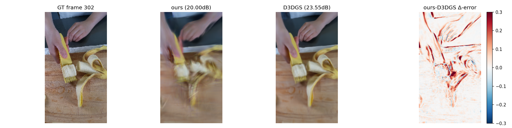
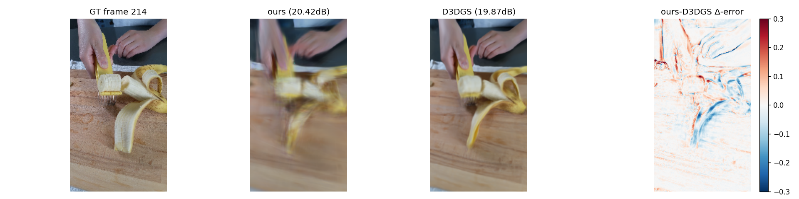
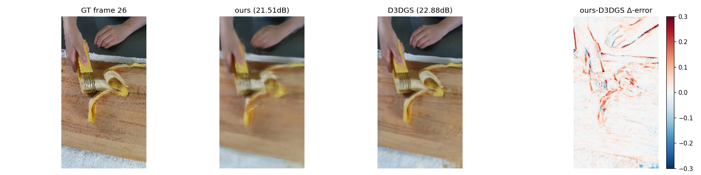

# RCA — Phase C vs Deformable3DGS on slice-banana scale 4 14k iters

Aggregate over 82 test frames (deformable_interp val split, ids[2::4]):

| metric | ours (Phase C) | Deformable3DGS | gap |
|---|---|---|---|
| PSNR (dB) | 23.25 | 25.62 | -2.37 |
| L1 | 0.0434 | 0.0322 | +0.0113 |

## Worst-3 frames of ours (per-frame heatmaps)

- frame 302: ours 19.97dB, d3dgs 23.74dB, Δ -3.77
  
- frame 214: ours 20.36dB, d3dgs 19.99dB, Δ +0.37
  
- frame  26: ours 21.47dB, d3dgs 23.01dB, Δ -1.53
  